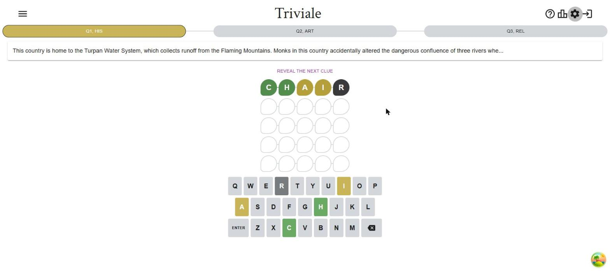
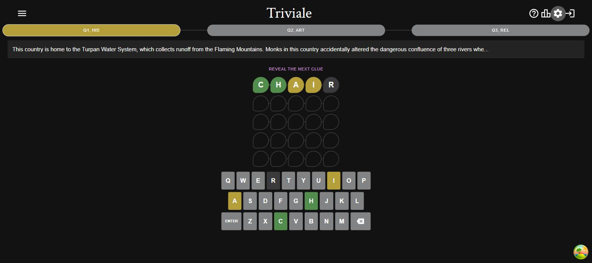

# Triviale Code Review — 2026-09-02

Review of `70aae8c` (typing, flip, win-wave, and confetti animations), with
follow-up fixes started in the same working session.

## Findings

### Resolved — winning rows suppressed the flip animation

`src/components/grid/Cell.tsx:150-158` (pre-fix)

On a live winning submission, a Cell received its newly scored `status` and
`winBounceDelayMs` in the same render. The animation conditional selected the
delayed bounce before it considered `isFlipping`, so the effect that later set
`isFlipping` could not make the flip visible. The confetti/dialog delay still
waited for the theoretical flip duration, but the user only saw the wave.

Fixed by composing the non-overlapping flip and delayed bounce into one CSS
animation value. The regression test now asserts that a live winning score
contains both animations.

### Resolved — completed rows replayed their win wave on mount

`src/components/grid/GameGrid.tsx:105-107` and `src/components/grid/Cell.tsx`
(pre-fix)

Every mounted final row for a won question received `winBounceDelayMs`. That
replayed the wave after restoring a completed game or returning to a completed
question tab, unlike the intended no-replay behavior of score flips.

Fixed by starting the wave only when the Cell transitions from unscored to
scored. A Cell that mounts with existing scored state stays still.

### Resolved — reduced-motion changes could leave a score mid-flip

`src/components/grid/Cell.tsx:108-120` (pre-fix)

If the system preference changed to reduced motion after a status arrived, the
effect treated the status as no longer new and returned before revealing it or
clearing the active flip. The preference now independently reveals any pending
status and clears both animation states immediately.

### Resolved — scored tiles froze in the previous theme's colors

`src/components/grid/Cell.tsx` (pre-fix)

`Cell` cached the `PaletteColor` object it was scored with in `displayStatus`
and only refreshed it at the flip midpoint. `ThemedLayout` rebuilds the theme
in place on a dark-mode or colorblind toggle, so every palette object was
replaced without remounting any Cell; the effect saw the new object as a
changed `status` prop but early-returned because the tile was already
revealed, leaving the old mode's color on screen. Before the animation work
the tile read `status.main` directly and so always followed the theme.

Reproduced on the unfixed build by scoring a guess in dark mode, then
switching to light: the tiles kept the dark palette (near-black "R", dark
green/yellow) while the keyboard keys directly below switched to the light
palette.

After the fix, tiles and keys change together:

Fixed by making a letter's status a palette *key* (`LetterStatus`:
`"success" | "warning" | "error" | "primary"`) end to end -- `GameGrid`
computes keys, `GameRow` compares keys and uses sx theme paths for the
connector color, and `Cell` resolves `theme.palette[displayStatus]` on every
render. `SampleGame` and `LandingLogo` pass keys too. The effect now also
mirrors the prop whenever the tile is already revealed, so a dependency
change mid-flip reveals the color immediately instead of cancelling the
pending reveal and never colouring the tile.

### Resolved — a repeat Enter during the game-end delay double-counted stats

`src/pages/HomePage.tsx` `onEnter` (pre-fix)

The game-end block (`winGame`/`loseGame`, `logGame`, the per-category
recording) ran on every Enter press once no question was in progress; only
the stats dialog opening synchronously kept a second press from reaching it.
With the dialog now held back ~2.5 s behind the flip, wave, and confetti, a
second tap on the on-screen ENTER key (a mobile double-tap, say) landed in
that window and `logGame` -- which is additive -- counted the day twice. The
same thing already happened before this branch on any Enter after dismissing
the dialog, or after reloading a finished game.

Fixed by only ending the game and logging when this render's `gameState` is
still `"inProgress"`; any later press just reopens the stats dialog.

## Verification

- `npm run lint`
- `npm test -- --run`
- `npm run build`
