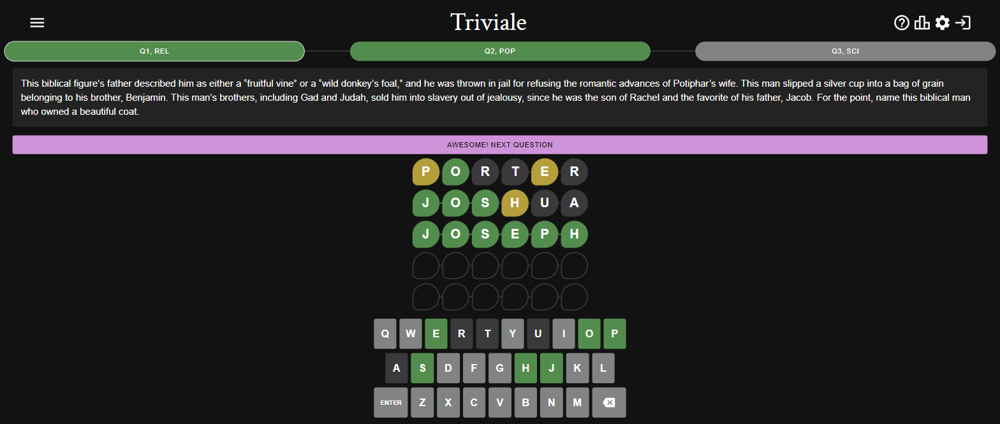

# [Triviale]
[Triviale]: https://www.triviale.net/


A daily trivia game that pairs Wordle-style guessing with real trivia questions. Type an answer, get letter-by-letter feedback, and each wrong guess reveals a bit more of the question.



## How it works

1. A new set of questions arrives each day, spanning categories like history, science, and pop culture.
2. Type a guess; letters are marked correct, present, or absent, the same as Wordle.
3. A wrong guess reveals more of the question as a hint.
4. Share a spoiler-free summary of your results once you're done.

## Features

- Three new questions every day, drawn from categories like history, science, and pop culture
- Expandable questions that reveal more context as you play
- Wordle-style letter-by-letter feedback
- Hard mode (answer length isn't shown up front)
- Dark mode and a high-contrast mode
- User accounts, so progress and stats carry across devices

## Technical info

- Front end: React + TypeScript, MUI for components, Zustand for state, React Query for data fetching
- Hosted on [Vercel](https://vercel.com/), auto-deployed from the `production` branch; `main` is the working/staging branch
- User accounts are handled by Auth0
- Questions currently ship as static local data (`src/data/questions.ts`); a MongoDB-backed API exists in the codebase but isn't wired up yet
- Questions are drafted with GPT-4 assistance and reviewed by a [QA engineer](https://github.com/mncasay) a day ahead of publishing

## Setup

Requires `npm`.

```bash
npm install
npm run dev
```

This starts Triviale locally at `http://localhost:5173/`.

No `.env` file is required — the app falls back to the production Auth0 tenant and API endpoint baked into source. To point a local/staging build at a different Auth0 tenant or API endpoint instead, copy `.env.example` to `.env.local` and fill in `VITE_AUTH0_DOMAIN`, `VITE_AUTH0_CLIENT_ID`, and/or `VITE_API_BASE_URL`.
